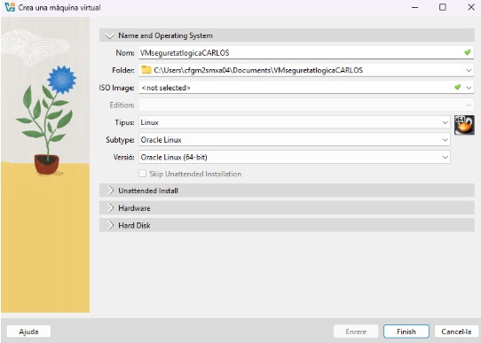

Primer he hagut de crear una nova màquina tal com es veu a la captura

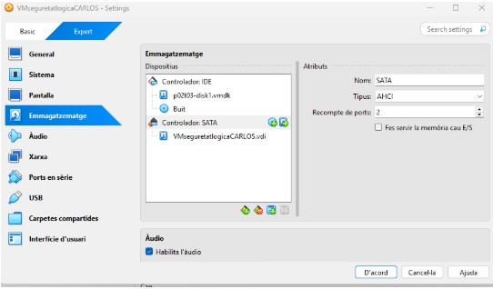

Seguidament a paràmetres, emmagatzematge, hauríem d'afegir el disk dur que en carlos ens ha proporcionat i col·locar-lo a dalt de tot.

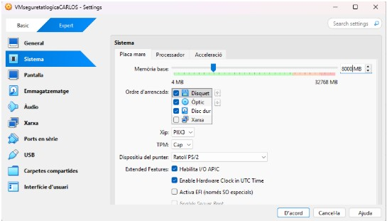

La configuració de la màquina es 8000 de placa mare.

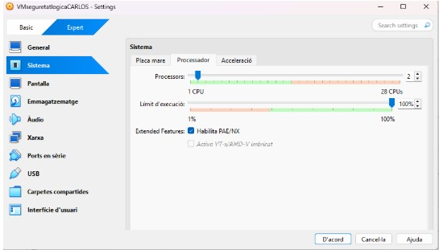

I a la part de processadors posem 2.

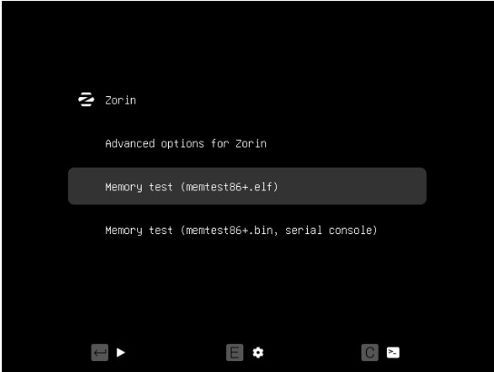

Un cop configurada la màquina li donem a inicia i a la que et surti amb gran VIRTUALBOX mentres s'obre la màquina has de mantenir el shift i una lletra a la vegada i s’obrira aquest menú i apretem la primera opció. 

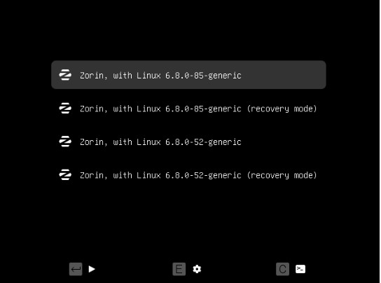

Despres s’obrira aquest que em d’inicia la segona el (recovery mode). 

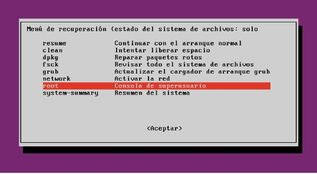

I en aquesta part baixem a on posa “root” i li donem a acceptar.

 

FORTIFICAR L'ACCÉS AL GRUB:

Fem “sudo i” per entrar com a root

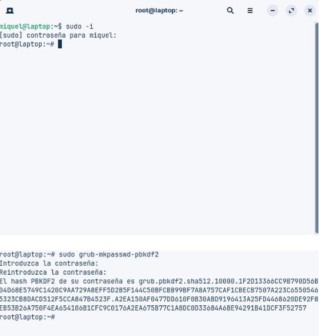

Ara hem instal·lat al GRUB i li hem donat una contraseña. 

“copiem tot el hash desde grub fins al final de tot del hash” 

![foto(img/captura12.jpg)

Primer entrem a la terminal i farem un /backup de la carpeta home amb la comanda:
“sudo rsync -aAXv /home /root/home-backup-$(date +%F)/”

Ara crearem al fitxer-contenidor amb aquestes comandes:

sudo mkdir -p /root/secure-containers
cd /root/secure-containers

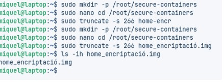

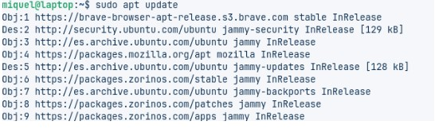

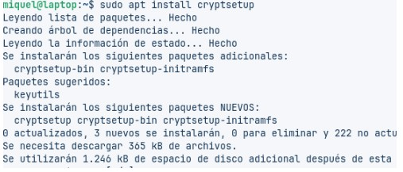

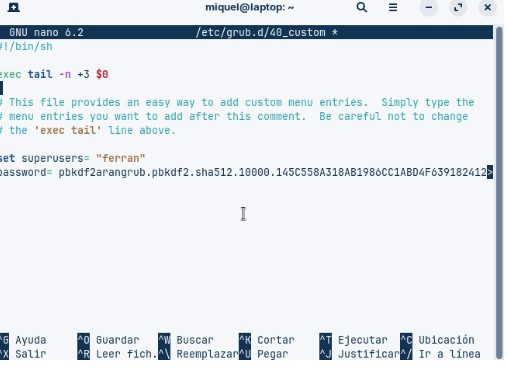

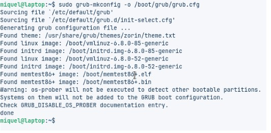

